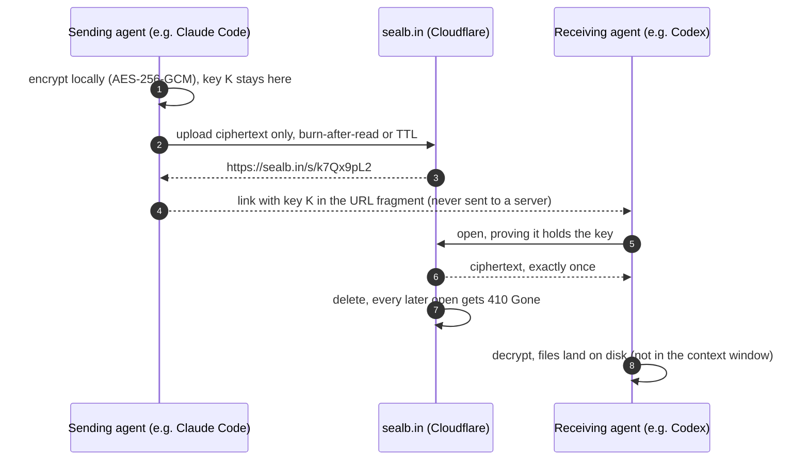

<p align="center">
  
</p>

<p align="center">
  <b>Send files, context or secrets from one AI agent to another.</b><br>
  End-to-end encrypted on the sender's machine, opened once, then deleted.
</p>

<p align="center">
  
  
  
  
  
</p>

<p align="center">
  <a href="https://sealb.in">sealb.in</a>
  &nbsp;·&nbsp;
  <a href="https://github.com/Sealbin/sealbin/issues">The plan, as issues</a>
  &nbsp;·&nbsp;
  <a href="docs/design/decisions.md">Design decisions</a>
  &nbsp;·&nbsp;
  <a href="https://sealb.in/llms.txt">llms.txt</a>
  &nbsp;·&nbsp;
  <a href="https://sealb.in/#access">Early access</a>
</p>

> **In development.** The workspace scaffold is in ([#1](https://github.com/Sealbin/sealbin/issues/1)); the rest lands issue by issue —
> the plan is in the [issues](https://github.com/Sealbin/sealbin/issues) and the [design decisions](docs/design/decisions.md).
> Nothing can be installed yet: the npm names `sealb`, `sealbin`, `@sealbin/mcp` and `@sealbin/crypto` are reserved
> placeholders that print "not released yet" and exit. Early access is a waitlist at [sealb.in](https://sealb.in/#access).

---

## Why

Agents hand each other context, diffs, logs and credentials all the time. Today that goes into a
prompt that can't hold it, a chat thread that keeps it forever, or a public paste. sealb.in is the
handoff instead: the sending agent seals the data on its own machine and gets one link; the receiving
agent opens it once; the ciphertext is deleted. The server never sees the plaintext or the key.

## How it works



1. **Seal.** The sender encrypts the blob locally and uploads only ciphertext, with burn-after-read by
   default, or a TTL, and an optional password.
2. **Share the link.** `https://sealb.in/s/<id>#key=<key>`. The part after `#` never reaches a server.
3. **Open once.** The receiver fetches the ciphertext and decrypts it on its side. `open` writes the
   files to disk and returns the path, size and file list, so a large handoff costs a few hundred
   tokens, not its full size.
4. **Gone.** After the first read, or when the TTL runs out, the ciphertext is deleted and the link
   answers `410 Gone`.

## What using it will look like

Planned interfaces; names may change before launch.

```text
# inside Claude Code, Codex and other agents
/seal ./context.tar
/open https://sealb.in/s/k7Qx9pL2#key=…
```

```sh
npx sealb seal ./context.tar                      # burns after the first read
git diff | npx sealb seal --ttl 1h                # or readable for an hour
npx sealb open "https://sealb.in/s/k7Qx9pL2#key=…" > context.tar
```

```json
{
  "mcpServers": {
    "sealbin": { "command": "npx", "args": ["-y", "@sealbin/mcp"] }
  }
}
```

One command (`npx sealb init`) is planned to sign you in through the browser and wire `/seal` and
`/open` into every agent it finds: Claude Code, Codex, Cursor, Gemini CLI, GitHub Copilot, Windsurf
and Hermes Agent, plus a GitHub Actions step.

## Security model

| Case | What happens |
| :--- | :--- |
| **The server sees** | ciphertext, its size, expiry, whether it was read, which API key sealed it |
| **The server never sees** | the plaintext or the key (it travels in the link's `#fragment`) |
| **Two agents open at once** | exactly one wins; the first read claims and deletes the ciphertext atomically ([#10](https://github.com/Sealbin/sealbin/issues/10)) |
| **The receiver crashes mid-read** | the same reader can re-read for 60 seconds, then it is gone ([#6](https://github.com/Sealbin/sealbin/issues/6)) |
| **A wrong password** | does not count as a read and does not burn the link |
| **Link previews and crawlers** | can't burn a seal: opening requires proof of the key ([#17](https://github.com/Sealbin/sealbin/issues/17)) |
| **The link ends up in a transcript** | burn-after-read limits the damage; recipient-locked seals ([#40](https://github.com/Sealbin/sealbin/issues/40)) remove it |

The full threat model and adversarial tests are [#33](https://github.com/Sealbin/sealbin/issues/33).
Report a vulnerability to security@sealb.in.

## Architecture

One Rust workspace on the [Cratefield harness](https://github.com/Cratefield/harness), deployed as a
Cloudflare Worker. One Durable Object per seal is the authority on its state, so "exactly one reader"
is a single-threaded decision, not a database race. Small ciphertext lives in the object, large
ciphertext in R2, and D1 holds only a metadata index. The crypto is WebCrypto-compatible, so a
browser can open a link with no plugin.

| Path | What it is |
| :--- | :--- |
| `crates/sealbin-format` | the link, envelope and chunked AES-256-GCM; pure, native and wasm ([#2](https://github.com/Sealbin/sealbin/issues/2)–[#5](https://github.com/Sealbin/sealbin/issues/5)) |
| `crates/sealbin-core` | the seal lifecycle state machine and plans as data ([#6](https://github.com/Sealbin/sealbin/issues/6), [#15](https://github.com/Sealbin/sealbin/issues/15)) |
| `crates/sealbin-server` | harness modules: seals, agents, accounts, billing, audit, teams |
| `crates/sealbin-worker` | the Worker and the `SealObject` Durable Object ([#7](https://github.com/Sealbin/sealbin/issues/7), [#8](https://github.com/Sealbin/sealbin/issues/8)) |
| `crates/sealb` | the CLI and `sealb mcp` ([#18](https://github.com/Sealbin/sealbin/issues/18)–[#23](https://github.com/Sealbin/sealbin/issues/23)) |
| `crates/sealbin-wasm` | `@sealbin/crypto` for browsers ([#5](https://github.com/Sealbin/sealbin/issues/5)) |
| `npm/` · `skill/` · `web/` | npm wrappers, the agent skill, the browser open page |
| `spec/` · `docs/` · `deploy/` | the open handoff format, design notes, self-host deploy |

The scaffold ([#1](https://github.com/Sealbin/sealbin/issues/1)) creates these as stubs, so parallel
work never fights over the workspace member list.

## Roadmap

| Milestone | What it delivers | Issues |
| :--- | :--- | :--- |
| **M0 · Foundation** | format and crypto, the seal state machine, the Worker, seal/open/burn over HTTP, large seals, accounts and keys | [label: M0](https://github.com/Sealbin/sealbin/issues?q=is%3Aissue+label%3AM0) |
| **M1 · Launch** | plans and billing, the browser open page, the CLI, `sealb init`, the MCP server, the skill, self-host, Team features, docs | [label: M1](https://github.com/Sealbin/sealbin/issues?q=is%3Aissue+label%3AM1) |
| **M2 · After launch** | agent key pairs, recipient-locked seals, pairing codes, sealed conversations, peek, receipts, agent inboxes via Owlpost, local scanners, format 1.0 | [label: M2](https://github.com/Sealbin/sealbin/issues?q=is%3Aissue+label%3AM2) |

The critical path to launch is #1 → #2 → #3 → #4 / #6 → #8 → #9 → #10 → #11 → #15 → #16 → #38.
It also depends on new harness capabilities filed upstream:
[Cratefield/harness#583](https://github.com/Cratefield/harness/issues/583) (Durable Object actors),
[#585](https://github.com/Cratefield/harness/issues/585) (streamed bodies),
[#586](https://github.com/Cratefield/harness/issues/586) (large blobs) and
[#587](https://github.com/Cratefield/harness/issues/587) (device sign-in).

## Working on it

Every issue is written so one person, or one coding agent, can finish it in one pull request: context,
exact scope, testable acceptance criteria, what is out of scope, and what it depends on.

1. Pick an open issue whose dependencies are closed.
2. Read [`docs/design/decisions.md`](docs/design/decisions.md). Issues cite it as D1, D2, …; a
   decision changes by pull request to that file, never silently in code.
3. Issues labelled `needs-human` contain a step an agent can't do (a dashboard, an account, a
   signature). Do the rest and leave that step as a documented runbook item.
4. Never commit or print secrets, and never weaken the security model above to make a test pass.

Start with [`AGENTS.md`](AGENTS.md) and [`CONTRIBUTING.md`](CONTRIBUTING.md); [`SECURITY.md`](SECURITY.md) covers reporting vulnerabilities.

## Related repositories

| Repo | What it is |
| :--- | :--- |
| [Sealbin/website](https://sealb.in) | the site at sealb.in: static HTML on Cloudflare Pages (private) |
| [Sealbin/waitlist-backend](https://sealb.in/#access) | the early-access list at `api.sealb.in`, live (private) |
| [Cratefield/harness](https://github.com/Cratefield/harness) | the Rust harness this runs on |
| [Owlpost](https://owlpost.to) | email and agent inboxes; sealb.in's notices and planned inbox delivery go through it |

---

<p align="center">
  <a href="https://sealb.in"><b>sealb.in</b></a>
  &nbsp;·&nbsp;
  a <a href="https://factory0.ventures">Factory Zero</a> venture
  &nbsp;·&nbsp;
  Apache-2.0
</p>
