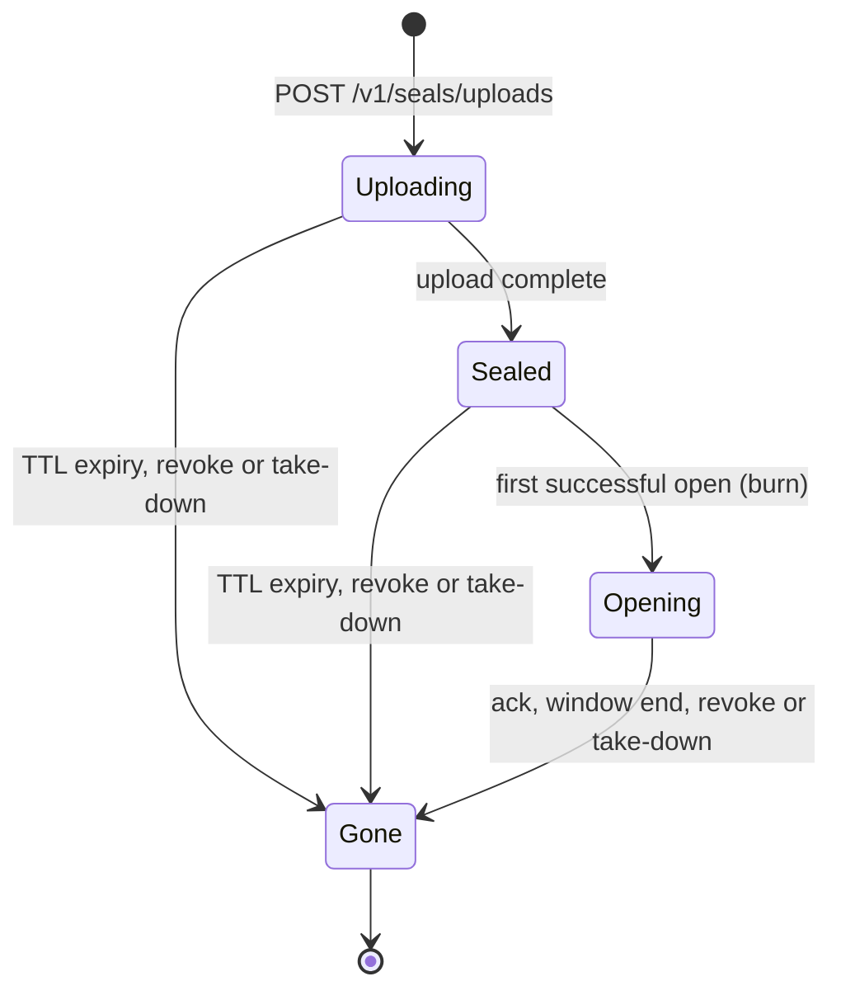

# The seal lifecycle

The state machine `crates/sealbin-core/src/seal.rs` implements lives here. It is
normative for the server; the spec is `spec/handoff-format.md` §9 and D8 in
`docs/design/decisions.md`.

Everything is pure. Every command takes the current unix-millisecond time as an
argument and returns an outcome plus a list of `Effect`s (delete, abort, set
alarm, record audit event) for the caller to carry out. There is no clock, no
randomness and no I/O in the machine, so it compiles for
`wasm32-unknown-unknown` and is tested as plain Rust.

## States

`revoke` ends the seal as `Gone(Revoked)`; `take_down` ends it as `Gone(Abuse)`.
Either can fire from any live state, `Uploading` included.

`Opening` carries `opened_at` and `SHA-256(reopen_token)`. `Gone` carries a
`GoneReason` and when it happened. `Uploading` carries the upload id and parts
received.

`GoneReason::Read` is reserved: no transition in this design produces it. A burn
seal ends via `Acked` or `ReopenWindowClosed`. The variant exists because the
issue defines it and issues #8/#30 may use it.

## Transition table

Every mutating command (`open`, `reopen`, `ack`, `alarm`, `revoke`, `take_down`)
first applies the time-based settle (below). `now` is the millisecond the
command arrives. Effects are listed in the order the code emits them. The table
is one row per `(state, command)` pair; the code tests all of them.

| State | Command | Outcome | New state | Effects |
| :--- | :--- | :--- | :--- | :--- |
| `Uploading` | `open` (right or wrong) | `Gone` | unchanged | — |
| `Uploading` | `reopen` | `Gone` | unchanged | — |
| `Uploading` | `ack` | `Ignored` | unchanged | — |
| `Uploading` | `alarm` | next alarm = `expires_at` | unchanged | — |
| `Uploading` | `revoke` | — | `Gone(Revoked)` | `AbortUpload`, `RecordEvent(Gone)` |
| `Uploading` | `take_down` | — | `Gone(Abuse)` | `AbortUpload`, `RecordEvent(Gone)` |
| `Uploading` | `metadata` | `gone` | unchanged | — |
| `Sealed` (burn) | `open` right token | `Granted { reopen_token: Some(t) }` | `Opening { opened_at: now, reopen_hash: SHA-256(t) }` | `SetAlarm(now + 60_000)`, `RecordEvent(Opened)` |
| `Sealed` (burn) | `open` wrong token | `WrongKey { retry_after_ms }` | unchanged | `RecordEvent(WrongKey)` |
| `Sealed` (any) | `open` during backoff | `Throttled { retry_after_ms }` | unchanged | — |
| `Sealed` (any) | `reopen` / `ack` | `Gone` / `Ignored` | unchanged | — |
| `Sealed` | `alarm` | next alarm = `expires_at` | unchanged | — |
| `Sealed` | `revoke` | — | `Gone(Revoked)` | `DeleteCiphertext`, `RecordEvent(Gone)` |
| `Sealed` | `take_down` | — | `Gone(Abuse)` | `DeleteCiphertext`, `RecordEvent(Gone)` |
| `Sealed` | `metadata` | `sealed` while `now < expires_at`, else `gone` | unchanged | — |
| `Sealed` (non-burn) | `open` right token | `Granted { reopen_token: None }` | unchanged (`reads += 1`) | `RecordEvent(Opened)` |
| `Opening` | `open` (right or wrong) | `Gone` | unchanged | — |
| `Opening` | `reopen` right token | `Granted` | unchanged (`reads += 1`) | `RecordEvent(Reopened)` |
| `Opening` | `reopen` wrong token | `Gone` | unchanged | — |
| `Opening` | `ack` right token | `Acked` | `Gone(Acked)` | `DeleteCiphertext`, `RecordEvent(Gone)` |
| `Opening` | `ack` wrong token | `Ignored` | unchanged | — |
| `Opening` | `alarm` | next alarm = `opened_at + 60_000` | unchanged | — |
| `Opening` | `revoke` / `take_down` | — | `Gone(Revoked / Abuse)` | `DeleteCiphertext`, `RecordEvent(Gone)` |
| `Opening` | `metadata` | `gone` | unchanged | — |
| `Gone` | any mutating command | `Gone` / `Ignored` / `None` | unchanged | — |
| `Gone` | `revoke` / `take_down` | — | unchanged | — |
| `Gone` | `metadata` | `gone` | unchanged | — |
| `Sealed` past `expires_at` | any command but `metadata` | `Gone` / `Ignored` / `None` | `Gone(Expired)` | `DeleteCiphertext`, `RecordEvent(Gone)` |
| `Uploading` past `expires_at` | any command but `metadata` | `Gone` / `Ignored` / `None` | `Gone(Expired)` | `AbortUpload`, `RecordEvent(Gone)` |
| `Opening` past its window | any command but `metadata` | `Gone` / `Ignored` / `None` | `Gone(ReopenWindowClosed)` | `DeleteCiphertext`, `RecordEvent(Gone)` |
| any state, past its boundary | `metadata` | `gone` | unchanged | — |

The three rows above the last are the settle-then-run cases: the command sees
the seal already `Gone`. Note `Uploading` expires to `AbortUpload`, not
`DeleteCiphertext` — there is no object to delete yet. The last row is
`metadata`, which reports `gone` without settling (it never mutates).

Two consequences worth stating plainly:

- A burn seal's `metadata` reads `gone` as soon as it is `Opening`, because it
  is no longer retrievable by anyone but the holder.
- A `Gone` seal never emits a delete effect again: the ciphertext is deleted
  exactly once per seal, ever.

## Time-based settling

At the start of every mutating command (`open`, `reopen`, `ack`, `alarm`,
`revoke`, `take_down`) the record settles first:

- `Sealed` or `Uploading` with `now >= expires_at` → `Gone(Expired)`.
- `Opening` with `now >= opened_at + 60_000` → `Gone(ReopenWindowClosed)`.

`metadata` is the exception: it never mutates. It reports `sealed` only for a
`Sealed`, unexpired record and `gone` otherwise, computing its answer as if
settled but leaving the record (and its effects) alone.

TTL expiry does not cut an open window short: `Opening` ignores `expires_at`
entirely, so a seal can be reopened after its TTL passed as long as it is still
inside its window (spec §9).

### Boundary conventions

Both boundaries are half-open; the boundary instant is the *first* instant past
it.

- **Expiry.** A seal is unopened while `now < expires_at`. At `now == expires_at`
  it is expired: `open` returns `Gone`.
- **Window.** A reopen is allowed while `now < opened_at + 60_000`. At
  `now == opened_at + 60_000` the window has closed.
- **Wrong-key backoff.** A retry is allowed while `now >= next_attempt_at`. At
  `now == next_attempt_at` the attempt is evaluated again.

## Wrong keys never destroy the seal

A wrong `read_token` cannot burn, expire or shrink anything (D6, spec §4, spec
§9). It increments `failed_attempts`, sets `next_attempt_at = now +
min(1s << (n-1), 5min)`, and does nothing else. The state is untouched. While
inside the backoff an `open` is `Throttled` and the token is not even evaluated,
so timing cannot be used to probe it. A successful open resets the counter and
clears the backoff.

## Why a second opener does not end the first's window

The first successful open of a burn seal moves it to `Opening`, which belongs to
one reader. Any further `open` — however soon, even in the same millisecond —
gets `Gone` and leaves the state exactly as it was, so the holder's 60 seconds
are not cut short (spec §9). Only the holder of the `reopen_token` can `reopen`
or `ack`. A wrong `reopen_token` is likewise `Gone` with no state change, so a
guesser cannot end the window either.

This is what lets a crashed opener resume: the CLI writes the reopen token to
disk before reading the body (D8), and a fresh process reopens with it inside
the window.

## Persisted shape

A `SealRecord` is stored as JSON by the Durable Object. The two hashes
(`read_verifier`, and `reopen_hash` inside `Opening`) are fixed 64-character
lowercase-hex strings rather than byte arrays; `state` and `storage` are
internally tagged with a `kind` field; enum values are `snake_case`. The test
suite pins this shape so a record written by one build still round-trips in the
next.

## Why "atomic" holds

Production runs one `SealRecord` inside a Durable Object, and the Durable
Object's serial, single-threaded execution is what makes "exactly one of any
number of concurrent opens wins" true (D9, spec §9, issue #8): the concurrent
opens are simply run one after another on the one record, which is exactly what
the same-millisecond test does.
