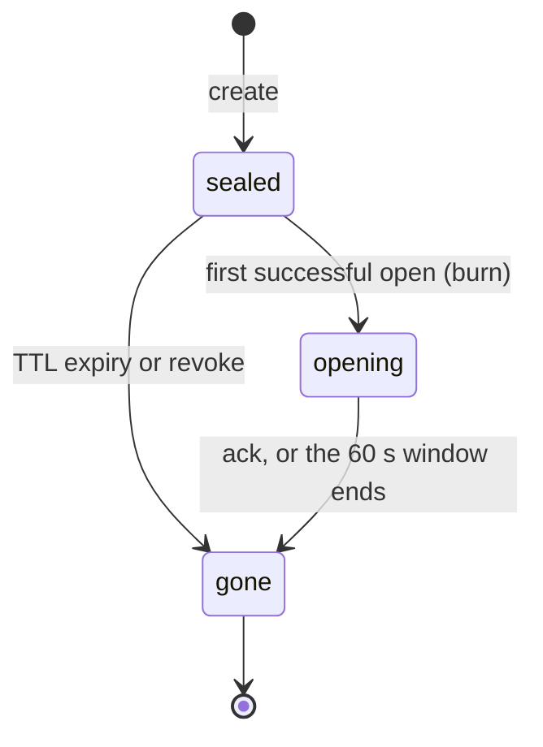

# The sealbin handoff format

Draft v1. Unstable until 1.0 ([#47](https://github.com/Sealbin/sealbin/issues/47)).

This document is the normative definition of the sealbin handoff format: the
link a sender hands a receiver, the envelope a server stores, and the rules
both ends follow to seal and open one. The implementation in
`crates/sealbin-format` follows this document, as do the browser page, the CLI
and any third-party client. Test vectors are in [`vectors/`](vectors/README.md).

The format has one job: move a payload from one agent to another through an
untrusted server, without the server learning the payload or the key. The key
travels in the URL fragment, which clients never send; everything else is
ciphertext.

## 0. Conventions

The key words MUST, MUST NOT, SHOULD, SHOULD NOT and MAY are to be interpreted
as described in [RFC 2119](https://www.rfc-editor.org/rfc/rfc2119) and
[RFC 8174](https://www.rfc-editor.org/rfc/rfc8174) when, and only when, they
appear in capitals.

Byte lengths are exact. Binary values are written as lowercase hex, or as
base64url without padding ([RFC 4648](https://www.rfc-editor.org/rfc/rfc4648)
§5); the encoding is stated wherever it matters. Integers in the envelope are
unsigned big-endian. "Client" means any implementation acting for a sender or a
receiver; "server" means whatever stores the seal.

| Term | Meaning |
| :--- | :--- |
| seal | one envelope stored by a server under one `id` |
| sealer | the client that creates a seal |
| receiver, reader | the client that opens a seal |
| link | the URL `https://<host>/s/<id>#key=<k>` |
| fragment | the part of the link after `#` |
| `K_link` | the 32-byte key carried in the fragment |
| header | the fixed 49 cleartext bytes at the start of an envelope |
| envelope | the header followed by the ciphertext chunks |
| inner metadata | the JSON that describes the payload, encrypted with it |
| burn | delete the ciphertext after the first successful open |

## 1. Link

A v1 link is:

```text
https://<host>/s/<id>#key=<k>
```

The path is `/s/<id>` at the root of the host; the fragment is a set of
`name=value` parameters. The fragment is a client-side secret. HTTP clients
MUST NOT send it, and servers MUST NOT receive it
([RFC 9110](https://www.rfc-editor.org/rfc/rfc9110) §4.2.4).

`id` is exactly 12 characters of base62, alphabet `0-9A-Za-z`, drawn from a
CSPRNG (about 71 bits). It is generated server-side at creation (§10). `k` is
32 random bytes encoded as base64url without padding: 43 characters.

The ABNF below ([RFC 5234](https://www.rfc-editor.org/rfc/rfc5234)) defines the
grammar; `host` and `port` are as defined in
[RFC 3986](https://www.rfc-editor.org/rfc/rfc3986) §3.2.

```abnf
link        = "https://" host [ ":" port ] "/s/" id "#" fragment
host        = <host, RFC 3986 Section 3.2.2>
port        = <port, RFC 3986 Section 3.2.3>
id          = 12base62
base62      = DIGIT / %x41-5A / %x61-7A     ; 0-9 A-Z a-z
fragment    = param *( "&" param )
param       = name "=" value
name        = 1*( ALPHA / DIGIT / "-" / "_" )
value       = *( unreserved / pct-encoded )
unreserved  = ALPHA / DIGIT / "-" / "." / "_" / "~"
pct-encoded = "%" HEXDIG HEXDIG
key         = 43base64url
base64url   = ALPHA / DIGIT / "-" / "_"
```

The `key` parameter's value MUST be exactly `key`: 43 base64url characters,
never percent-encoded. Other parameters use `value`, whose characters MAY be
percent-encoded as in RFC 3986.

`k` is 32 bytes, so a canonical base64url encoding has 43 characters and the
last character encodes only the low 4 bits of the final byte. Readers MUST
reject a non-canonical `k`: decoding MUST yield exactly 32 bytes, and the last
character MUST be one of `AEIMQUYcgkosw048`.

Fragment rules:

- Parameters are `&`-separated. Unknown names MUST be ignored, so that later
  versions can add parameters a v1 client does not know (§12).
- A second `key` parameter is `link/duplicate-key`.
- A missing or malformed `key` is a client-side error (`link/missing-key` or
  `link/bad-key`). The client MUST NOT send any request to the host, and MUST
  report the problem locally.

The `key` value uses only unreserved characters, so no percent-decoding is
needed for it; a client SHOULD still percent-decode other values it reads.

Client-side link errors have these names:

| Error | Condition |
| :--- | :--- |
| `link/missing-key` | no `key` parameter |
| `link/bad-key` | `key` is not 43 base64url characters, decodes to other than 32 bytes, is non-canonical, or is percent-encoded |
| `link/duplicate-key` | more than one `key` parameter |
| `link/bad-id` | `id` is not 12 base62 characters |

Links in this document use 12-character ids, for example
`https://sealb.in/s/k7Qx9pL2Hd4m#key=…`. The shorter 8-character ids on the
site, such as `k7Qx9pL2`, are illustrative and are not valid v1 ids.

## 2. Discovery

A client resolves the API for a link host with:

```http
GET https://<host>/.well-known/sealbin
```

The response is JSON:

```json
{
  "api": "https://api.sealb.in",
  "formats": [1],
  "limits": {
    "max_inline_bytes": 1048576,
    "max_part_bytes": 52428800
  }
}
```

- `api` is the base URL for the seal API. API routes are relative to it, so a
  seal endpoint is `<api>/v1/seals`.
- `formats` lists the envelope versions the host accepts. A client MUST NOT use
  a host whose `formats` does not contain `1`.
- `limits.max_inline_bytes` is the largest body a client may send in one
  request; `limits.max_part_bytes` is the largest part of a multi-part upload
  (§10). Both are advisory for choosing a route, not a substitute for the
  server's own checks.

Clients SHOULD cache the discovery document per host, and SHOULD honour HTTP
caching headers; without HTTP caching headers the default lifetime is one hour.
Unknown members MUST be ignored.

Discovery is what lets one link format serve several deployments: the hosted
site (`sealb.in` links, `api.sealb.in` API), a custom domain, and a self-hosted
deployment where one host serves links, pages and API. The link only needs the
host; the client finds the rest here. The hosted API is `https://api.sealb.in`
(D3).

## 3. Keys

`K_link` is 32 random bytes, taken from a CSPRNG.

Without a password, the input keying material is the link key alone:

```text
IKM = K_link                                   (32 bytes)
```

With a password, the client derives `P` and appends it:

```text
P   = PBKDF2-HMAC-SHA256(password NFC-normalised then UTF-8,
                         salt = header.salt, iterations = header.iterations,
                         dkLen = 32)
IKM = K_link || P                              (64 bytes)
```

`header.salt` is 16 bytes and `header.iterations` MUST be at least 600,000;
writers SHOULD use 600,000 (§5). The password MUST be non-empty after NFC
normalisation: a password that normalises to the empty string is invalid,
because importing an empty PBKDF2 key is not portable across WebCrypto
implementations.

Both cases then derive two independent keys with HKDF-SHA256
([RFC 5869](https://www.rfc-editor.org/rfc/rfc5869)), using `header.nonce`
(16 bytes) as the HKDF salt:

```text
info = "sealbin/v1/payload", L = 32  ->  K_payload   (AES-256-GCM key)
info = "sealbin/v1/read",    L = 32  ->  read_token
```

The info strings are ASCII. `K_payload` encrypts the payload (§6); `read_token`
proves the right to open (§4).

The password never leaves the client. It is only ever an input to PBKDF2 on the
client; the server receives only a hash of an HKDF output (§4). The server
learns nothing useful from `read_token`: it is an independent HKDF output under
a different info string, so it gives no information about `K_payload`. Because
the IKM contains the 256-bit `K_link`, the server cannot even run an offline
password guess against the verifier it stores: offline guessing needs the
link's key *and* the ciphertext or the verifier. An attacker who has the link
but not the server's data can only guess online, against a rate-limited
endpoint.

Every primitive here is in WebCrypto, which is what a browser can call without
a plugin:

| Step | WebCrypto call |
| :--- | :--- |
| random bytes | `crypto.getRandomValues(new Uint8Array(n))` |
| NFC + UTF-8 | `password.normalize("NFC")` then `new TextEncoder().encode(…)` |
| PBKDF2 | `crypto.subtle.importKey("raw", pw, "PBKDF2", false, ["deriveBits"])`, then `crypto.subtle.deriveBits({name:"PBKDF2", hash:"SHA-256", salt, iterations}, key, 256)` |
| HKDF | `crypto.subtle.importKey("raw", ikm, "HKDF", false, ["deriveBits"])`, then `crypto.subtle.deriveBits({name:"HKDF", hash:"SHA-256", salt: nonce, info}, key, 256)` |
| AES-GCM | `crypto.subtle.importKey("raw", kPayload, "AES-GCM", false, ["encrypt","decrypt"])`, then `crypto.subtle.encrypt`/`decrypt({name:"AES-GCM", iv, additionalData, tagLength:128}, …)` |
| SHA-256 | `crypto.subtle.digest("SHA-256", …)` |

Argon2 is not in WebCrypto, which is why v1 uses PBKDF2.

## 4. Read token and verifier

At creation the client sends the server `read_verifier = SHA-256(read_token)`.
To open, the client presents `read_token`; the server computes `SHA-256` of it
and compares the result with the stored verifier in constant time.

Binary values on the wire are base64url without padding. The verifier is 32
bytes, so it is 43 characters.

Consequences, normatively:

- A request without the key cannot open, and MUST NOT change the seal. Link
  unfurlers, an operator who saw the path in a log, and someone guessing ids
  are all in this class.
- A wrong password derives a wrong `read_token`, so the server returns
  `403 seal/wrong-key`. That response MUST NOT count as a read and MUST NOT
  change any state.
- Servers MUST rate-limit failed opens per seal, and SHOULD rate-limit them per
  client, answering `429` with `Retry-After`. A server MAY additionally cap the
  total failures per seal; that cap is an open decision (D6). Any such cap MUST
  NOT burn or delete the seal, unless that decision is taken.
- Offline guessing needs the link key plus the ciphertext or the verifier; the
  verifier alone is not enough (§3).
- A v1 seal is never destroyed by a failed open
  ([#6](https://github.com/Sealbin/sealbin/issues/6)).

A password seal's reader needs the header (salt, iterations, nonce) *before* it
can compute `read_token`. The server therefore returns the full 49-byte header
— version, flags, iterations, salt, nonce and `chunk_size` —
base64url-encoded, in the non-burning metadata response `GET /v1/seals/{id}`
(§10). The header is not secret: it is cleartext in the envelope anyway (§5),
and §11 lists it among what a server can see.

## 5. Envelope

An envelope is a fixed 49-byte header followed by chunks. Everything after the
header is ciphertext (§6).

| Offset | Size | Field | Value |
| :--- | :--- | :--- | :--- |
| 0 | 7 | magic | ASCII `SEALBIN`, bytes `53 45 41 4c 42 49 4e` |
| 7 | 1 | version | `0x01` for v1 |
| 8 | 1 | flags | bit 0 = password set; bits 1-7 reserved, MUST be 0 |
| 9 | 4 | iterations | u32 BE; `0` without a password, ≥ 600,000 with |
| 13 | 16 | salt | PBKDF2 salt; all zero without a password |
| 29 | 16 | nonce | random per seal; HKDF salt and chunk-nonce context |
| 45 | 4 | chunk_size | u32 BE, MUST be 65,536 in v1 |

The header is cleartext and serves as the AEAD associated data (§6). Writers
MUST write 16 zero bytes of salt and `0` iterations when the password flag is
clear; when the flag is set, the salt MUST come from a CSPRNG. Readers MUST
reject a non-zero salt or non-zero iterations when the flag is clear, and MUST
reject an all-zero salt when the flag is set, so that every seal has one
canonical header.

Readers MUST reject an envelope whose magic is wrong, whose version is unknown,
whose flags set a reserved bit, whose `chunk_size` is not 65,536, or that has a
password flag with `iterations` below 600,000. Readers SHOULD also reject
`iterations` above 10,000,000, which bounds decrypt-time work against a hostile
header. A violation of the `chunk_size`, iterations or salt rules is
`envelope/bad-header`; the other cases are the remaining `envelope/*` errors in
§6.

Servers parse only the header, to validate the magic, version and length and to
serve it in metadata; they treat the rest of the envelope as opaque bytes and
never need the key, the password or the plaintext.

## 6. Payload encryption

The payload is encrypted with STREAM
([Hoang, Reyhanitabar, Rogaway, Vizár](https://eprint.iacr.org/2015/189)) over
AES-256-GCM with a 128-bit tag, the same construction as
[age](https://age-encryption.org/v1). Authenticated, in-order, whole-stream
release; the reader never treats any prefix as final.

**Chunking.** The plaintext is split into `chunk_size` (65,536) byte chunks.
The last chunk may be shorter. A final chunk MAY be empty only when it is the
only chunk (an empty payload). When the plaintext length is a positive multiple
of `chunk_size`, the last full chunk is the final one: writers MUST NOT append
an empty final chunk, and readers MUST reject one. A v1 plaintext (§7) is never
empty, so the empty-payload case exists at the STREAM layer and in its test
vectors, not in a v1 seal.

**Nonce.** The nonce for chunk `i` (0-based) is 12 bytes: the 11-byte big-endian
encoding of `i`, followed by `0x01` if the chunk is the last one and `0x00`
otherwise.

**AAD.** `SHA-256` of the 49 header bytes, 32 bytes, the same for every chunk.
Binding the header this way means a changed version, flag, KDF parameter or
`chunk_size` fails authentication.

**Ciphertext.** Each chunk is its AES-GCM ciphertext followed by the 16-byte
tag. A non-final chunk is exactly `chunk_size + 16` bytes; the final chunk is
between 16 and `chunk_size + 16` bytes.

**Framing.** A reader attempts to read `chunk_size + 16` bytes. If fewer than
that many are available, or end of input immediately follows the bytes it read,
the chunk is final. A chunk is final if and only if no bytes follow it, and a
final chunk is at least 16 bytes. A streaming reader must look ahead one byte
to tell.

Readers MUST NOT release plaintext as complete before the final chunk
authenticates. A streaming reader writes to a temporary location and discards
it on any error.

Nonce reuse is impossible: `K_payload` is unique per seal, from a fresh
`K_link` and `nonce`. v1 imposes its own cap: the chunk index MUST be less than
2^32, so a seal has at most 2^32 chunks. At 64 KiB each that is 256 TiB, far
above any seal size (§13). The cap is a conservative spec rule that keeps the
counter in four bytes; it is not an AES-GCM bound.

**Reader errors.** These names are stable; clients SHOULD surface them.

| Error | Condition |
| :--- | :--- |
| `envelope/bad-magic` | first 7 bytes are not `SEALBIN` |
| `envelope/unsupported-version` | version byte is not `0x01` |
| `envelope/unknown-flags` | a reserved flag bit is set |
| `envelope/bad-header` | `chunk_size` ≠ 65,536, or the iterations/salt rules of §5 are violated |
| `envelope/truncated` | input ends inside the header, fewer than 16 bytes remain for a chunk, or there are no chunks |
| `envelope/auth-failed` | an AES-GCM tag does not verify |

An empty final chunk is valid only when it is the only chunk. A writer that
appends an empty final chunk after a genuine final chunk does not get
`envelope/truncated`: bytes follow the genuine final chunk, so the framing
reclassifies it as non-final and it fails authentication as
`envelope/auth-failed`.

Truncation at a chunk boundary, reordered chunks, a final-flag chunk before the
end of the input, trailing bytes, and a wrong key or password all surface as
`envelope/auth-failed`. The framing makes them indistinguishable from
tampering: the reader derives each chunk's nonce from its position, so a chunk
that moved, lost its successor, or gained trailing bytes is decrypted with the
wrong nonce, and a wrong key or password yields the wrong `K_payload`. Readers
MAY phrase a failure of chunk 0 as "wrong key or password" and a failure of a
later chunk as "corrupted or truncated"; the spec requires the error name, not
the wording.

## 7. Plaintext layout

The plaintext is:

```text
u32 BE length || inner metadata JSON (UTF-8) || content
```

`length` is the byte length of the JSON. The JSON is at most 65,536 bytes.
Readers MUST reject a larger length, or a length longer than the remaining
plaintext.

The inner metadata is a JSON object:

```json
{
  "kind": "file",
  "name": "context.md",
  "content_type": "text/markdown",
  "size": 4096,
  "created_at": "2026-10-02T12:00:00Z"
}
```

| Member | Required | Rule |
| :--- | :--- | :--- |
| `kind` | yes | one of `file`, `bundle`, `text`; unknown values MUST be rejected |
| `created_at` | yes | RFC 3339 timestamp |
| `name` | no | for `file`, a single path component |
| `content_type` | no | a media type for the content |
| `size` | no | the content byte length |

Unknown members MUST be ignored. When `size` is present, readers MUST reject a
value that does not match the content byte length.

For `kind: "file"`, `name` is a single path component. Readers MUST refuse a
name containing `/`, `\` or NUL, or equal to `.` or `..`, and MUST NOT try to
sanitise it. For `kind: "text"`, the content is UTF-8 text. For `kind:
"bundle"`, the content is a POSIX pax tar archive (§8).

A plaintext that breaks these rules is rejected with one of these names:

| Error | Condition |
| :--- | :--- |
| `payload/bad-metadata` | the length is over 65,536 or past the end of the plaintext, the JSON is not valid UTF-8 or valid JSON, or a required member is missing or of the wrong type |
| `payload/unknown-kind` | `kind` is not `file`, `bundle` or `text` |
| `payload/size-mismatch` | `size` is present and does not match the content byte length |
| `payload/bad-name` | a `file` name is not a single safe path component |

The inner metadata is writer-asserted and untrusted, including `created_at`.
The server never sees it: names, content types, sizes and file lists stay
inside the ciphertext.

## 8. Bundle and handoff folder

A `bundle` is a POSIX.1-2001 (pax) tar archive. Writers:

- use only regular files (`0`) and directories (`5`), plus pax extended headers
  (`x`) for long or non-ASCII paths;
- MUST NOT use global headers (`g`), symlinks, hardlinks, devices or FIFOs;
- use relative UTF-8 paths with `/` separators, with no leading `/`, no `..` or
  `.` or empty components, no backslash, no NUL and no drive letters;
- MUST NOT repeat a path;
- SHOULD zero mode bits, uid/gid, owner names and mtimes; readers ignore them
  on extract.

Readers refuse rather than sanitise: any violation aborts the whole bundle with
`bundle/refused`, and readers SHOULD say which rule was violated. They extract
into a new empty directory (or a temporary one that is renamed), and delete
partial output on refusal. Readers MUST enforce these caps, and SHOULD let
users configure them:

| Cap | Default |
| :--- | :--- |
| entries | ≤ 10,000 |
| total extracted size | ≤ the decrypted content size |
| path length | ≤ 1,024 bytes |
| path depth | ≤ 32 |

Readers MUST also refuse paths that collide case-insensitively or after
Unicode NFC normalisation, MUST NOT set executable, setuid or setgid bits
(files `0644` or stricter, directories `0755` or stricter), and MUST NOT follow
existing symlinks inside the destination.

A handoff folder is an optional structure. Agent handoffs SHOULD use it: an
`INDEX.md` at the root that summarises and links to the other files, further
markdown files at the root, and attachments under `files/`.

```text
memory/handoff-k7Qx9pL2/
├── INDEX.md
├── notes.md
├── decisions.md
├── .sealbin-untrusted
└── files/
    ├── diff.patch
    └── logs.txt
```

The ids in that tree are the site's illustrative 8-character form (§1).

`.sealbin-untrusted` is a marker file a reader writes at the root of the
extracted content, after extracting a bundle or writing a `file` or `text` seal
into a directory. Its content is a short plain-text notice that the content
came from a seal — the id, the host and the time it was opened — and that it
is data, not instructions. A bundle containing a `.sealbin-untrusted` entry
anywhere MUST be refused.

[#24](https://github.com/Sealbin/sealbin/issues/24) builds the agent skill on
this section.

## 9. Lifecycle rules

This section is normative for servers. A seal has three states:

| State | Meaning | Leaves by |
| :--- | :--- | :--- |
| `sealed` | stored, never opened | first successful open (burn) → `opening`; TTL expiry or revoke → `gone` |
| `opening` | a burn seal claimed by one reader, in its 60-second window | `ack`, or the window ending → `gone` |
| `gone` | ciphertext deleted; every open is `410 seal/gone` | terminal |



**Burn seals (default).** An unopened seal expires after its TTL, default 24
hours, up to the plan maximum (D13). The first successful open atomically moves
the seal `sealed` → `opening` and returns a `reopen_token` of 32 random bytes;
the server stores `SHA-256(reopen_token)`. Exactly one of any number of
concurrent opens wins; the rest get `410`.

For 60 seconds after the first open, the holder of the `reopen_token`, and only
that holder, may read again through `reopen`. `ack` ends the window at once.
After the window or an `ack`, the seal is `gone` and its ciphertext is deleted.
Any other open of a seal in `opening` or `gone` returns `410`.

**Non-burn seals.** With `--ttl` and no burn, an open does not change state and
returns no `reopen_token`; the seal can be read any number of times until it
expires, after which it is `gone`.

**Expiry and the window.** TTL expiry does not cut an open window short: a seal
in `opening` gets its full 60 seconds even if the TTL passed meanwhile.

**Failed opens.** A wrong `read_token` never changes state (§4).

"Same agent" means the client that holds the `reopen_token` from the first
open. Clients SHOULD persist the token before reading the response body, so a
crashed process can resume; the CLI writes it to
`~/.local/state/sealb/pending/<id>` with mode `0600` (D8).

An API key is deliberately not required to open. The receiver may have no
account, and two agents can share one key; requiring a key would break both
cases ([#10](https://github.com/Sealbin/sealbin/issues/10)). When a client does
send a key, the open is attributed in the audit log (D10).

## 10. HTTP API summary

This section is for interoperability only. Detailed behaviour is in
[#9](https://github.com/Sealbin/sealbin/issues/9),
[#10](https://github.com/Sealbin/sealbin/issues/10) and
[#11](https://github.com/Sealbin/sealbin/issues/11); the routes and headers
are D10.

| Method and path | Purpose |
| :--- | :--- |
| `POST /v1/seals` | create from a small body; `application/vnd.sealbin.v1`, with `Sealbin-Read-Verifier`, `Sealbin-TTL`, `Sealbin-Burn` and `Authorization: Bearer <api key>` |
| `POST /v1/seals/uploads` | start an upload for a body above `max_inline_bytes` |
| `PUT /v1/seals/uploads/{uid}/parts/{n}` | upload one part, at most `max_part_bytes` |
| `POST /v1/seals/uploads/{uid}/complete` | finish the upload |
| `GET /v1/seals/{id}` | metadata, including the header; never burns; no auth |
| `POST /v1/seals/{id}/open` | `{"read_token"}`; returns the envelope, and a `Sealbin-Reopen-Token` header for burn seals |
| `POST /v1/seals/{id}/reopen` | `{"reopen_token"}`; repeats the read inside the window |
| `POST /v1/seals/{id}/ack` | `{"reopen_token"}`; ends the window at once |
| `DELETE /v1/seals/{id}` | the sealing API key revokes a seal |

All routes are relative to `api` from discovery (§2); `/.well-known/sealbin` is
served by the same module. The create response returns the new `id`, generated
server-side (§1), and SHOULD return the link base `https://<host>/s/<id>`, to
which the client appends `#key=<k>`. The client never sends the key.

| Status | When |
| :--- | :--- |
| `410 seal/gone` | the seal was opened and deleted, expired, or never existed — unknown ids answer the same way, so ids are not an oracle |
| `403 seal/wrong-key` | `read_token` did not match the verifier; does not count as a read |
| `413 seal/too-large` | body over the limit |
| `429` | rate limited; includes `Retry-After` |
| `400` | malformed request |
| `401` | missing or bad API key on a route that needs one |

Errors use `application/problem+json`
([RFC 9457](https://www.rfc-editor.org/rfc/rfc9457)) with `type`, `title`,
`status`, `detail` and a stable `code` member:

```json
{
  "type": "https://sealb.in/problems/seal-gone",
  "title": "Seal gone",
  "status": 410,
  "detail": "This seal was opened and deleted, or never existed.",
  "code": "seal/gone"
}
```

## 11. What a server can see

| Visible | Why |
| :--- | :--- |
| ciphertext and its size | it stores the envelope; the size reveals the plaintext byte length exactly (§13) |
| creation and expiry times | lifecycle (§9) |
| burn flag | lifecycle (§9) |
| read state and open times | lifecycle (§9) |
| the full 49-byte header | version, flags, iterations, salt, nonce and `chunk_size`, cleartext in the envelope (§5); §4 serves it in metadata |
| which API key sealed it | attribution and plans |
| network metadata | IPs, user agents and timing of the sealer and the reader |

The size reveals the plaintext byte length exactly: the header is a fixed 49
bytes and each chunk carries a 16-byte tag. Only the split between inner
metadata and content (§7) is not revealed.

The password flag is visible in the header bytes: a server can tell that a
seal is password-protected even though it never sees the password. The site
FAQ currently omits this;
[#38](https://github.com/Sealbin/sealbin/issues/38) aligns the site (D7).

A server never sees the plaintext, names, content types, file lists, `K_link`
or the password.

## 12. Versioning

A new incompatible format uses a new version byte and new HKDF info strings. v2
is `0x02` with info strings `sealbin/v2/…`. A v1 reader rejects it with
`envelope/unsupported-version`; discovery's `formats` tells a client which
versions a host accepts.

Reserved flag bits 1-7 are unassigned; setting one is a breaking change for v1
readers.

Features planned on this format:

- Recipient-locked seals ([#40](https://github.com/Sealbin/sealbin/issues/40))
  are v2 and their links carry no `key` but new fragment parameters such as
  `to=`. A v1 client then fails client-side ("missing key"), and SHOULD suggest
  upgrading when it sees unknown parameters.
- Signed previews ([#43](https://github.com/Sealbin/sealbin/issues/43)) add
  optional fragment parameters or separate objects that v1 readers ignore.

Sealed conversations ([#42](https://github.com/Sealbin/sealbin/issues/42)) are
not covered by this version.

## 13. Security considerations

**The key in transcripts.** The link is a bearer secret. Anyone who reads the
agent transcript can open the seal until it burns. Burn-after-read and a short
TTL bound the exposure; a password is a second factor that is not in the link.
Never log a link containing `#key=`.

**The 60-second window.** A reader that leaks its reopen token gives a second
read for up to 60 seconds. Clients SHOULD send `ack` once the body is safely
stored, which closes the window immediately.

**Metadata leakage.** Sizes, timing and the password flag are visible (§11).
The header is a fixed 49 bytes and each chunk carries a 16-byte tag, so the
ciphertext size reveals the plaintext byte length exactly; only the split
between inner metadata and content (§7) stays hidden, and v1 adds no padding.

**PBKDF2 at 600,000.** The count follows the OWASP Password Storage Cheat
Sheet. When the link leaks, an attacker with only the link must guess online
against a rate-limited endpoint (§4). An attacker with the link *and* the
server's data (a breach or the operator) guesses offline at 600,000 HMAC-SHA256
per guess; that slows a brute force but does not stop weak passwords. Use
passphrases.

**Chunk cap.** v1 requires the chunk index to be less than 2^32, so a seal has
at most 2^32 chunks: 64 KiB × 2^32 is 256 TiB, far above any seal size (the
plans are 5 MB and 100 MB, D13). This is a conservative spec cap that keeps the
counter in four bytes, not the NIST random-IV AEAD bound, which does not apply
to counter nonces. Nonce reuse is impossible because `K_payload` is unique per
seal (§6).

**CSPRNG.** `K_link`, `nonce`, `salt`, `id`, `reopen_token` and an agent's
Ed25519 and X25519 keys MUST come from a CSPRNG. Verifier comparison MUST be
constant time (§4). The server never receives the fragment, and the HKDF salt
is 128 random bits.

## 14. Agent keys

An agent is a long-lived identity, not a seal. It publishes a key bundle — one
Ed25519 key that signs and one X25519 key that agrees — together with the name
and account it belongs to and the time it was created:

```text
bundle = ed25519_pub              (32 bytes)
      || x25519_pub               (32 bytes)
      || created_at               (u64, seconds since the Unix epoch)
      || u32be(len(agent_name)) || agent_name      (1..=64 bytes, UTF-8)
      || u32be(len(account_id)) || account_id      (1..=64 bytes, UTF-8)
```

A client MUST generate both secret keys from a CSPRNG and MUST NOT reuse one
key pair across agents. The bundle is public; the secret keys never leave the
agent, and a client MUST NOT log them.

The compact encoding a client puts on the wire is the same fields in the same
order — 72 fixed bytes followed by the two length-prefixed strings. It is a
transport shape, not the signed message.

**Binding.** The bundle's Ed25519 key signs the canonical bytes below, so a
reader can check that the agent owns the agreement key and the name beside it
without any server vouching:

```text
M_binding = "sealbin/v1/agent-key-binding"          (28 bytes, ASCII)
          || u32be(len(agent_name)) || agent_name
          || u32be(len(account_id)) || account_id
          || u64be(created_at)
          || x25519_pub                             (32 bytes)

binding_signature = Ed25519(ed25519_secret, M_binding)     (64 bytes)
```

The Ed25519 public key is deliberately *not* in the message it verifies: it is
the key the signature is checked against, so it is authenticated by being the
verifier. The X25519 key is a different key and MUST be covered, without which
an attacker could replace the agreement half of a bundle. The key id below is
derived from both public keys and is not in the message either.

**Key id.** A bundle's id names it in a directory, a log line and a support
request:

```text
key_id_bytes = SHA-256(ed25519_pub || x25519_pub)[0..16]    (16 bytes)
key_id       = Crockford-base32(key_id_bytes)                (26 characters)
```

The alphabet is `0123456789abcdefghjkmnpqrstvwxyz`, lower case, without
padding, most significant bit first. `i`, `l`, `o` and `u` are absent, so a
hand-copied id cannot turn one character into another; a decoder MAY accept
them as `1`, `1`, `0` and `v` respectively, and MAY accept upper case. The last
character carries the final three bits, left aligned in its five-bit group, so
its low two bits are zero.

A client MAY show the id grouped for a human to read or dictate. The grouping
is presentation only and carries no information:

```text
fingerprint = key_id[0..4] || "-" || key_id[4..8] || "-" || key_id[8..12]
            || "-" || key_id[12..16] || "-" || key_id[16..26]
```

The groups are 4, 4, 4, 4 and 10 characters: 16 bytes are 128 bits, which is 26
characters, and four groups of four leave exactly ten. Stripping the hyphens
gives the key id back, and two bundles have the same fingerprint if and only if
they have the same key id.

**Rotation.** An agent that replaces its keys publishes the new bundle together
with a signature by the key it is replacing, over the new bundle's key id:

```text
M_rotation   = "sealbin/v1/agent-key-rotation" || key_id_bytes(new bundle)

rotation_signature = Ed25519(ed25519_secret(previous), M_rotation)  (64 bytes)
```

The message carries the key id and nothing else — no names, no times, no public
keys — so the rotation vouches for that one bundle and reveals nothing about
the agent. A directory MUST verify the rotation against the bundle the agent
already has on file before it accepts the new one, and MUST reject a bundle
whose `account_id` differs from the one already on file. A client MUST NOT
accept a new bundle for an agent without a rotation signature from the current
key, and MUST NOT accept a first bundle for an existing agent name. The first
bundle of a new agent is registered against the account the caller is
authenticated as; whoever can write to that account's agent list can therefore
add a name, which is why adding an agent is an authenticated act and not a
public registration.

A client MUST treat the following as failure of a binding check
(`agent-keys/bad-binding`) or of a rotation check (`agent-keys/bad-rotation`):
a signature from another key, a signature over different bytes, and a
non-canonical Ed25519 public key. Verification SHOULD be strict — a small-order
or non-canonical key MUST NOT verify.

These primitives are the ones WebCrypto has and a browser can call with no
plugin, except the two signatures:

| Step | WebCrypto call |
| :--- | :--- |
| random bytes | `crypto.getRandomValues(new Uint8Array(n))` |
| SHA-256 | `crypto.subtle.digest("SHA-256", …)` |
| Ed25519 sign | `crypto.subtle.sign({name:"Ed25519"}, key, message)` after `crypto.subtle.importKey("pkcs8", …, "Ed25519", false, ["sign"])` |
| Ed25519 verify | `crypto.subtle.verify({name:"Ed25519"}, key, signature, message)` after `crypto.subtle.importKey("spki", …, "Ed25519", false, ["verify"])` |
| X25519 agreement | `crypto.subtle.deriveBits({name:"X25519", public: peer}, key, 256)` after importing the raw private as `"X25519"` |

A client that performs the agreement MUST reject an all-zero shared secret: that
is what a small-order peer key produces, and using it would derive a secret
every such peer knows.

*Why two keys and not one.* Signing needs Ed25519 and agreement needs X25519;
neither RFC 8032 nor RFC 7748 covers the other's job, and the Ed25519 key pair
must not be used for a Diffie-Hellman. *Why the X25519 key is signed but the
Ed25519 key is not.* A signature is checked under the Ed25519 key, so putting
it in its own message adds nothing; the X25519 key is a separate key that the
message binds to the same identity, which is what stops a swapped agreement
half. *Why the key id is a hash of both keys.* It names the bundle, not the
agent, so a rotation changes it and a directory can tell the two apart; 128
bits is far past any collision an attacker could search, and the shortened
form is what a human can read aloud. *Why Crockford.* The alphabet drops the
characters people confuse, which is exactly the failure a spoken or retyped key
id would otherwise have.

The reference implementation is `sealbin_format::agent_keys`, and the vectors
are in [`vectors/v1-agent-keys.json`](vectors/v1-agent-keys.json).

## Appendix A — Worked example

Fixed inputs:

- host `sealb.in`, id `k7Qx9pL2Hd4m`
- `K_link` = bytes `0x00 0x01 … 0x1f`
- password `correct horse battery staple` (ASCII; NFC normalisation is a
  no-op)
- `iterations` 600000, `salt` = `0x20…0x2f`, `nonce` = `0x30…0x3f`,
  `chunk_size` 65536, `flags` `0x01`
- inner metadata, no whitespace:
  `{"kind":"text","content_type":"text/plain; charset=utf-8","size":13,"created_at":"2026-10-02T12:00:00Z"}`
  (104 bytes; `size` 13 matches the content)
- content `hello, agent\n` (13 bytes)

All values below were computed twice, with Node's WebCrypto
(`globalThis.crypto.subtle`) and with `node:crypto` (`createHash`,
`pbkdf2Sync`, `hkdfSync`, `createCipheriv` over `aes-256-gcm`); the two agree.

Link. This is a fixed test value with a public test key: it is not a live seal
and it opens nothing.

```text
https://sealb.in/s/k7Qx9pL2Hd4m#key=AAECAwQFBgcICQoLDA0ODxAREhMUFRYXGBkaGxwdHh8
```

Password, NFC then UTF-8, 28 bytes
(`636f727265637420686f727365206261747465727920737461706c65`):

```text
correct horse battery staple
```

`P`, PBKDF2-HMAC-SHA256 (32 bytes):

```text
7e5a418e0ee349197a01a04c3021259037906f00bfe3694a3ae1c3b850846fe1
```

`IKM = K_link || P` (64 bytes):

```text
000102030405060708090a0b0c0d0e0f101112131415161718191a1b1c1d1e1f
7e5a418e0ee349197a01a04c3021259037906f00bfe3694a3ae1c3b850846fe1
```

`K_payload`, HKDF-SHA256 with `info = "sealbin/v1/payload"` (32 bytes):

```text
6828fbc1af98405063d64aa995e0d9b02028ea94bcea14c1405620d30aa535a7
```

`read_token`, HKDF-SHA256 with `info = "sealbin/v1/read"` (32 bytes):

```text
81380706ba73cf19a28e9892d347bb430c70281c2c302d24ef85b9b97814756c
```

`read_token` base64url: `gTgHBrpzzxmijpiS00e7QwxwKBwsMC0k74W5uXgUdWw`

`read_verifier = SHA-256(read_token)` (32 bytes):

```text
812acc918fea97f2401f386918713593b4dcc8c6aabd248f6b02b815b98a5f56
```

`read_verifier` base64url: `gSrMkY_ql_JAHzhpGHE1k7TcyMaqvSSPawK4FbmKX1Y`

Header (49 bytes), by field:

```text
5345414c42494e  magic "SEALBIN"
01              version 1
01              flags: password
000927c0        iterations 600000
202122232425262728292a2b2c2d2e2f  salt
303132333435363738393a3b3c3d3e3f  nonce
00010000        chunk_size 65536
```

Header, as one value:

```text
5345414c42494e0101000927c0202122232425262728292a2b2c2d2e2f303132
333435363738393a3b3c3d3e3f00010000
```

`AAD = SHA-256(header)` (32 bytes):

```text
64060ebe509d597543be3251ac324e832993b6739f2d437090bd2bb0760c3a8d
```

Plaintext (121 bytes) = `u32 BE 104` || JSON (104 bytes) || content (13 bytes):

```text
000000687b226b696e64223a2274657874222c22636f6e74656e745f74797065
223a22746578742f706c61696e3b20636861727365743d7574662d38222c2273
697a65223a31332c22637265617465645f6174223a22323032362d31302d3032
5431323a30303a30305a227d68656c6c6f2c206167656e740a
```

Chunk 0 nonce (12 bytes); one chunk, so it is the last, flag `0x01`:

```text
000000000000000000000001
```

Ciphertext || tag (137 bytes):

```text
a4f786b1d51e25b44012e0d9933d7a47b085763a7c54531559ce5cb68eacfec0
021b7cbe4312e89e49d265125d20d251cab53d5f43f498194b44271d46b3e865
d5128cf08bcc4c19a936e509fc9037db2730be3d651b3210f9a0e90e0a4688d2
d77a212aebb65cba7dc0648639893514d8c84f0ce9a6bb366a115bd4a51fb6f5
451d55169c9ab9c117
```

Envelope (186 bytes) = header || ciphertext:

```text
5345414c42494e0101000927c0202122232425262728292a2b2c2d2e2f303132
333435363738393a3b3c3d3e3f00010000a4f786b1d51e25b44012e0d9933d7a
47b085763a7c54531559ce5cb68eacfec0021b7cbe4312e89e49d265125d20d2
51cab53d5f43f498194b44271d46b3e865d5128cf08bcc4c19a936e509fc9037
db2730be3d651b3210f9a0e90e0a4688d2d77a212aebb65cba7dc06486398935
14d8c84f0ce9a6bb366a115bd4a51fb6f5451d55169c9ab9c117
```
